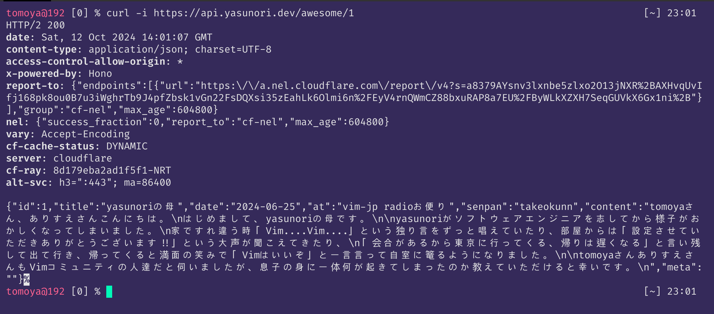
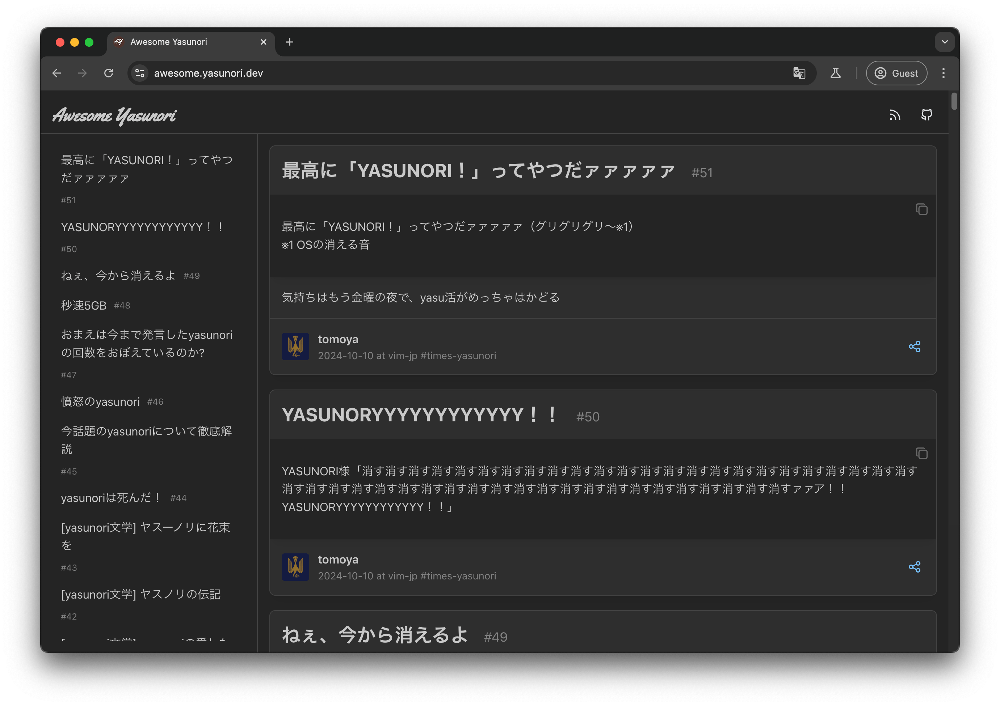
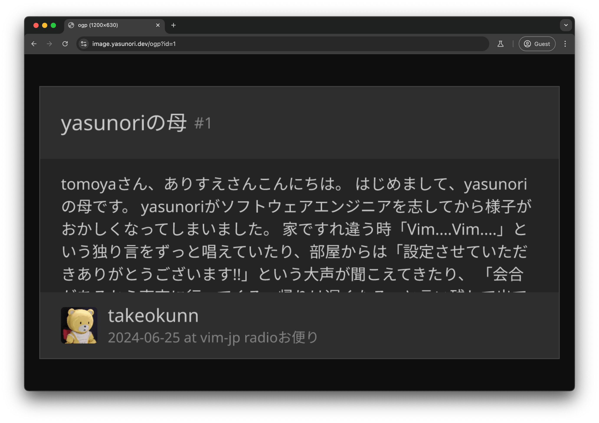
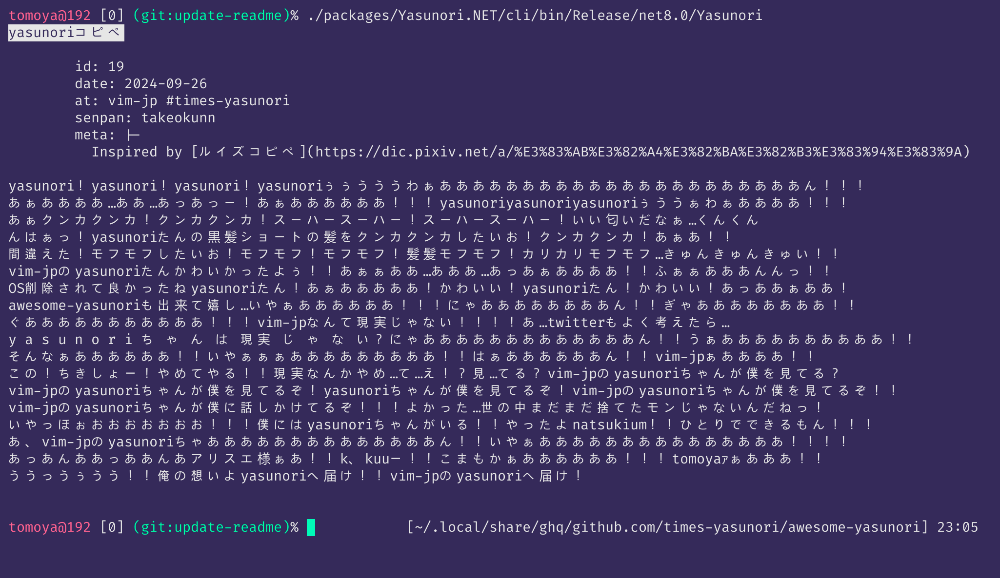
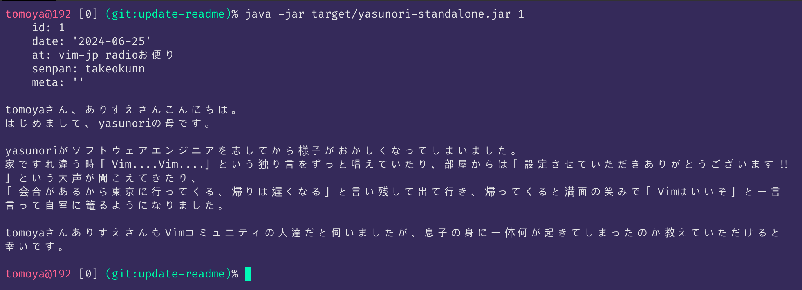
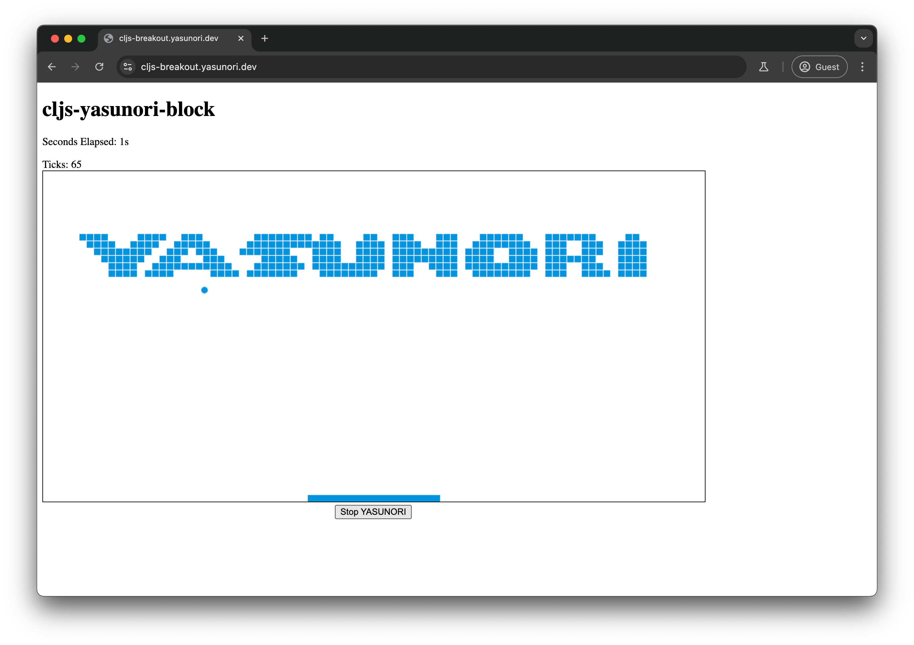

# Awesome Yasunori

A curated list of awesome yasunori, the post about [yasunori0418](https://github.com/yasunori0418). Inspired by [mattn/awesome-sonomasakada](https://github.com/mattn/awesome-sonomasakada).

- Web https://awesome.yasunori.dev
- APIs https://api.yasunori.dev

> [!CAUTION]
> It's a story YOU([takeokunn](https://github.com/takeokunn)) started by use ME([yasunori0418](https://github.com/yasunori0418))!!
>
> お前([takeokunn](https://github.com/takeokunn))が俺([yasunori0418](https://github.com/yasunori0418))で始めた物語だろ！！
>
> by [yasunori0418(原義)](https://github.com/yasunori0418)

## Contributing

Please take a quick gander at the [contribution guidelines](https://github.com/times-yasunori/awesome-yasunori/blob/master/CONTRIBUTING.md) first.
Thanks to all [contributors](https://github.com/times-yasunori/awesome-yasunori/graphs/contributors); you rock!

## How to add Awesome Yasunori

To add "awesome yasunori", simply add a new entry in [yasunori.toml](./yasunori.toml).

Anyone can join freely, so please feel free to create a Pull-request.

## Awesome Yasunori Products

Awesome Yasunori has cool products that is exceptionally great.

### [Yasunori APIs](https://api.yasunori.dev)

The Yasunori APIs are web APIs that utilize a curated list related to [yasunori0418](https://github.com/yasunori0418).

It's being developed in [packages/api](./packages/api).

### [Awesome Yasunori Web](https://awesome.yasunori.dev)

This is a website that allows you to elegantly appreciate "Awesome Yasunori" by utilizing the APIs of Yasunori.

It's being developed in [packages/web](./packages/web).

### [Awesome Yasunori JSON Schema](./schema.json)

This is the sole JSON Schema exclusively for Awesome Yasunori in the world.

### [Awesome Yasunori Image Generator](https://image.yasunori.dev/ogp?id=1)

This is an application that generates images from Awesome Yasunori.

It's being developed in [packages/image-generator](./packages/image-generator).

### [Yasunori.NET](./packages/Yasunori.NET)

Client software for console output using Yasunori APIs.

Yasunori list output, ID individual specification output, and OGP image output (Sixel support terminal required) are available.

It's being developed in [packages/Yasunori.NET](./packages/Yasunori.NET).

If you use Nix package manager, try `nix run github:times-yasunori/awersome-yasunori#yasunori-net`!

### [clojure-yasunori](./packages/clojure-yasunori)

clojure-yasunori is a CLI command written in Clojure that utilizes Yasunori APIs.

It's being developed in [packages/clojure-yasunori](./packages/clojure-yasunori).

### [cljs-yasunori-block](https://cljs-breakout.yasunori.dev)

cljs-yasunori-block is a block breaking game written in ClojureScript. You can play it here.

https://cljs-breakout.yasunori.dev

It's being developed in [packages/cljs-yasunori-block](./packages/cljs-yasunori-block).
